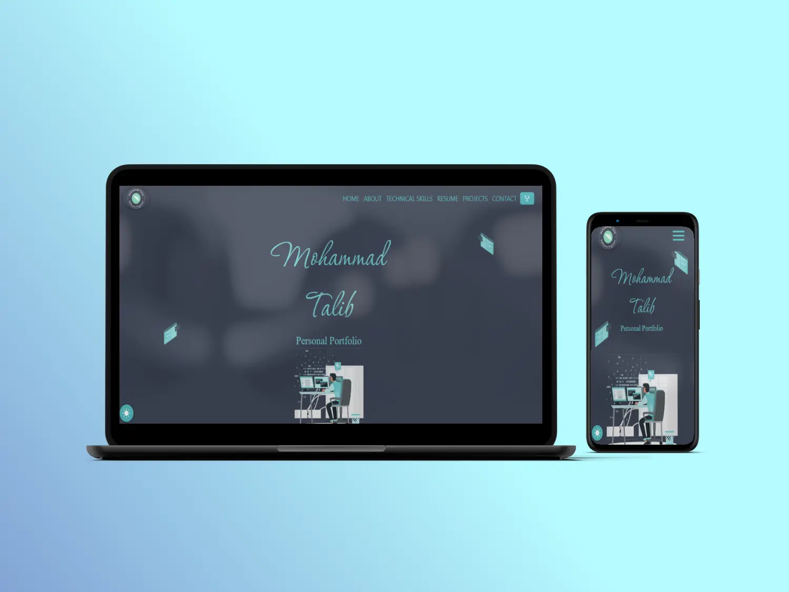

<h2 align="center">
  Mohammad Talib<br/>
  <a href="https://talib8335.github.io/" target="_blank">https://talib8335.github.io/</a>
</h2>
<h4 align="center">Portfolio Website</h4>
<div align="center">
  
</div>

# Built With


# Features <a id="features"></a>

- Fully Responsive Portfolio Website
- Modern UI Design
- Single Page layout
- Includes dark mode
- Comes with Bootstrap grid system
- Easy colour changes can be done through simple variable edits

# Contribute  <a id="contribute"></a>
Contributions are welcome, and they are greatly appreciated! Every little bit helps, and credit will always be given.

Please star the repo and feel free to make pull requests

## Not sure where to start?  <a id="wheretostart"></a>

#### Step 1:

Download or clone this repository by using the command given below:

```
git clone https://github.com/Talib8335/Talib8335.github.io.git
```

Runs the app in the development mode
Open http://localhost:8000 to view it in the browser. The page will reload if you make edits
